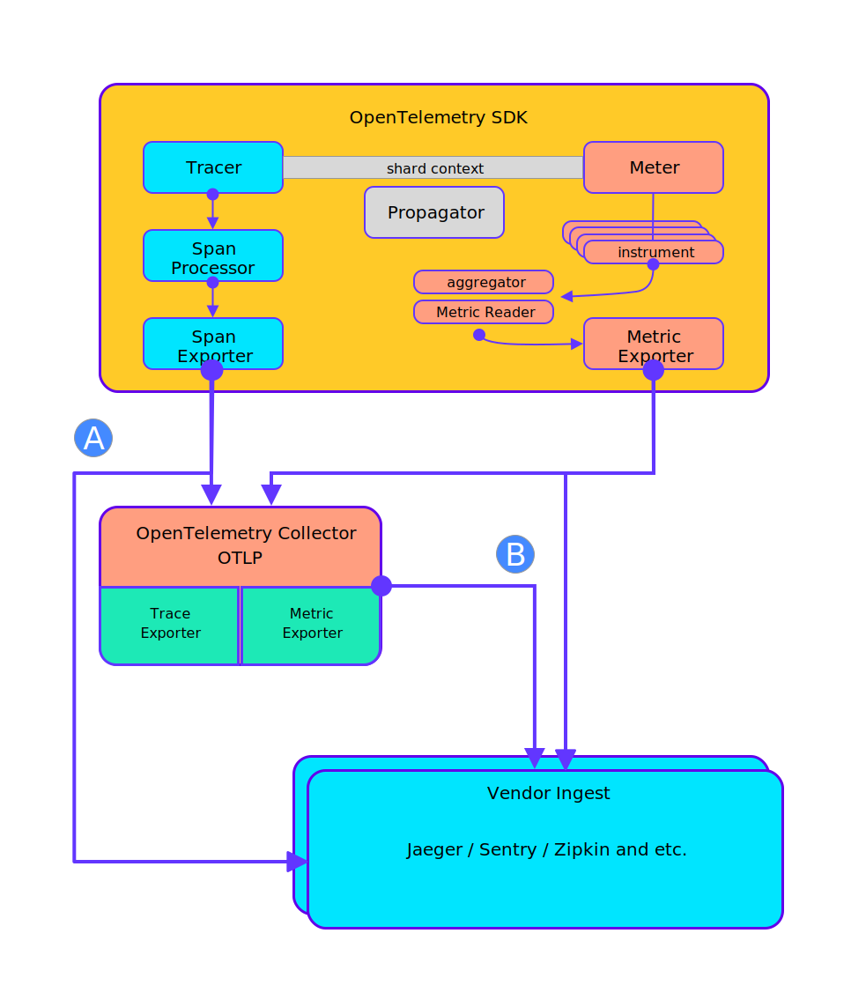

<div align="center"></div>

# opentelemetry

[](https://goreportcard.com/report/github.com/yeqown/opentelemetry-quake) [](https://pkg.go.dev/github.com/yeqown/opentelemetry-quake)

适用 opentelemetry 规范的链路追踪仓库，开发这个仓库的目的是：简化项目中对接链路追踪的代码，并统一搜集行为。
当然这个库比较偏私人定制（参考下面描述的工作内容），因此不具备通用库的特性，因此不推荐直接引用，但是对想要使用 opentelemetry 和二次开发的开发者有参考价值。

本仓库的工作内容：

- 在遵守 opentelemetry 的使用规范上对外提供链路追踪API，避免仓库直接引用 opentelemetry, 减轻使用者负担。
- 允许使用 sentry, otlp 和 jaeger 等后端服务，同时减少使用配置（使用默认配置和内置配置；从环境变量读取）。
- 开发 sentry span-exporter（这部分参考 [sentry-exporter](https://github.com/open-telemetry/opentelemetry-collector-contrib/tree/main/exporter/sentryexporter) ）另外增加了部分改动，这部分会持续维护。
- 对于服务端的常用场景提供了中间件，例如：HTTP（gin）, gRPC，HTTP Client (resty)。

### TODO:

- [x] sdk 可用
- [x] 采集堆栈信息
- [x] 跟前端链路打通
- [x] 中间件完成与优化
- [x] 处理代码中 `TODO` 和 `FIXME`
- [x] 记录请求和响应（可选）
- [ ] 补充测试用例
- [x] 改造 sentryexporter（TraceExporter）记录 StackTrace信息或者给官方提交 PR

### [Examples](./examples/README.md)

### Deploy OpenTelemetry Collector

https://opentelemetry.io/docs/collector/getting-started/

***k8s***

```sh
kubectl apply -f ./.deploy/k8s-otelcol.yaml
```

### Supplement

***1. How build you custom collector***

> For more details, please check out the .build folder.

```sh
## install build
go install go.opentelemetry.io/collector/cmd/builder@latest

## write build config
cat > ~/.otelcol-builder.yaml <<EOF
exporters:
  - gomod: "github.com/open-telemetry/opentelemetry-collector-contrib/exporter/alibabacloudlogserviceexporter v0.37.0"
EOF

## execute build command

builder --output-path=.
# or builder --config ~/.otelcol-builder.yaml
```

***2. Architecture of opentelemetry***

<div align="center"></div>

### Reference

- https://github.com/open-telemetry/opentelemetry-collector/tree/main/cmd/builder
- https://github.com/open-telemetry/opentelemetry-collector-contrib/issues/6218